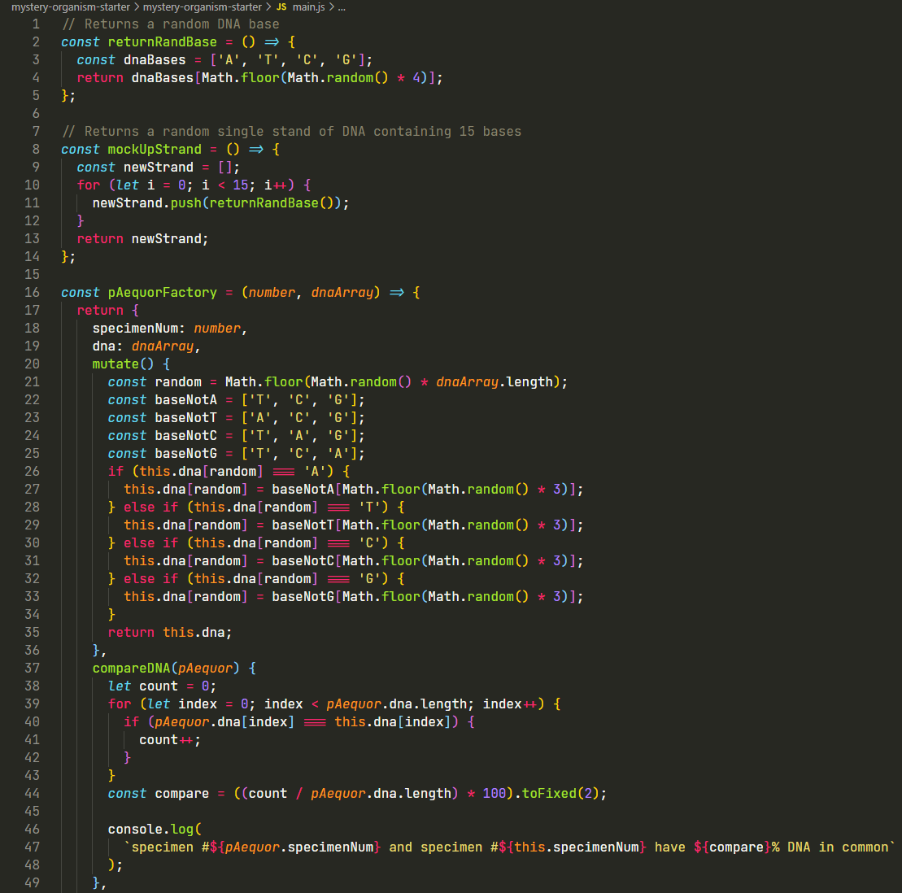
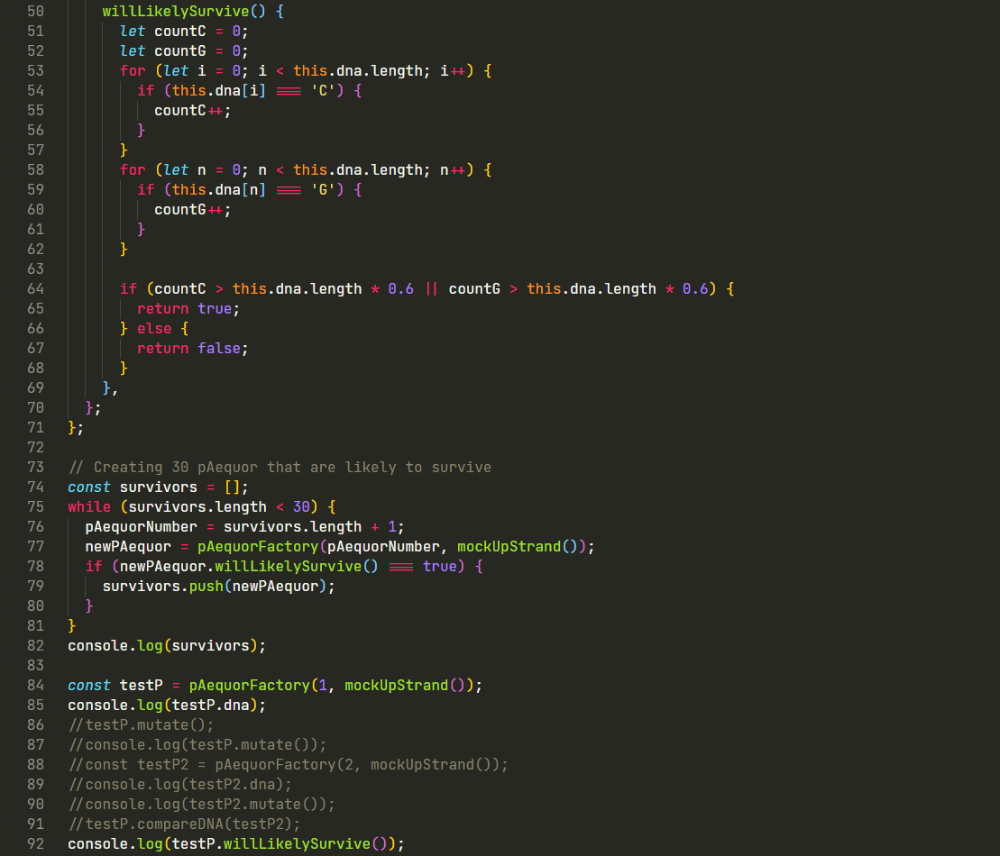

# Mysterious Organism

## Table of Contents

- [Project Goals](#project-goals)
- [Technologies Used](#technologies-used)
- [Screenshots](#screenshots)
- [Project Status](#project-status)
- [Contact](#contact)

## Project Goals

- Context: You’re part of a research team that has found a new mysterious organism at the bottom of the ocean near hydrothermal vents. Your team names the organism, _Pila aequor (P. aequor)_, and finds that it is only comprised of 15 DNA bases. The small DNA samples and frequency at which it mutates due to the hydrothermal vents make _P. aequor_ an interesting specimen to study. However, _P. aequor_ cannot survive above sea level and locating _P. aequor_ in the deep sea is difficult and expensive. Your job is to create objects that simulate the DNA of _P. aequor_ for your research team to study.

## Technologies Used

&nbsp;&nbsp;
&nbsp;&nbsp;
&nbsp;&nbsp;
&nbsp;&nbsp;

## Screenshots

## Project Status

Project is: _complete_.

## Contact

.
